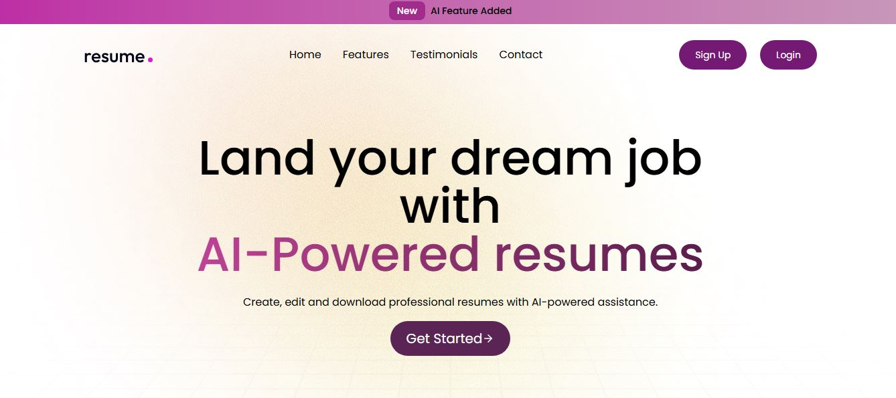
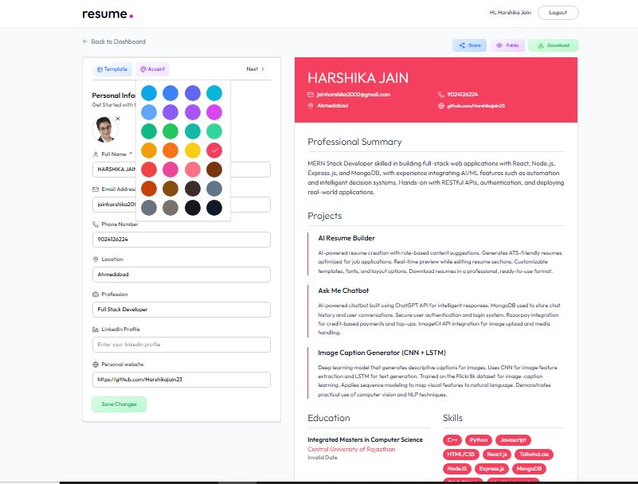

# 
# 

# AI Resume Buidler

A **web application that generates ATS-friendly, customizable resumes** using **AI (Gemini API)** and **ImageKit API**. Users can create, edit, share, and download professional resumes instantly.


##  Live Demo

[Check Live App Here](https://byharshikajain.in)


---

##  Features

- Generate ATS-friendly resumes automatically
- Customizable templates and content
- Edit, share, and download resumes
- Powered by Gemini API for AI resume content
- Uses ImageKit API for optimized images and templates
- Simple, responsive, and user-friendly interface

---

##  Tech Stack

- **Frontend**: React, Tailwind CSS
- **Backend**: Node.js, Express
- **Other**: Axios for API requests, Gemini API, ImageKit API

---

## Step 1: Clone the repository
```
git clone https://github.com/Harshikajain23/ai-resume-builder.git
```

## Step 2: Navigate to the project directory
```
cd ai-resume-builder
```
## Step 3: Configure environment variables

Create a .env file in the server folder:

```
PORT=5000
AI_API_KEY=your_gemini_api_key
IMAGEKIT_PUBLIC_KEY=your_imagekit_public_key
IMAGEKIT_PRIVATE_KEY=your_imagekit_private_key
```

## Step 4: Install dependencies

Backend
```
cd server
npm install
```

Frontend
```
cd ../client
npm install
```

## Step 5: Run the application

Start backend
```
cd server
npm start
```

Start frontend
```
cd ../client
npm start
```


Frontend runs on: http://localhost:3000

Backend runs on: http://localhost:5000
